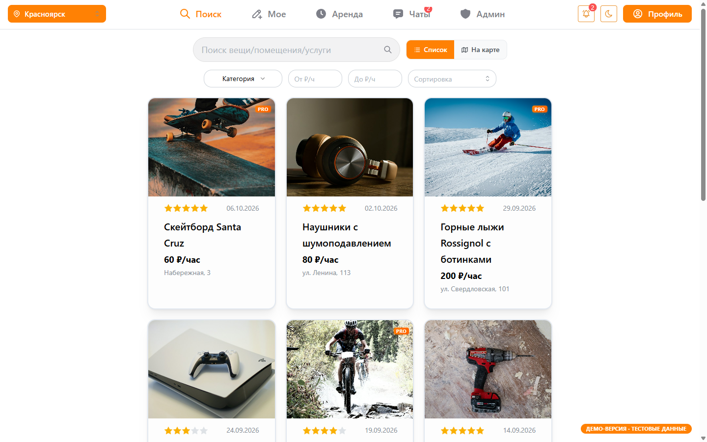
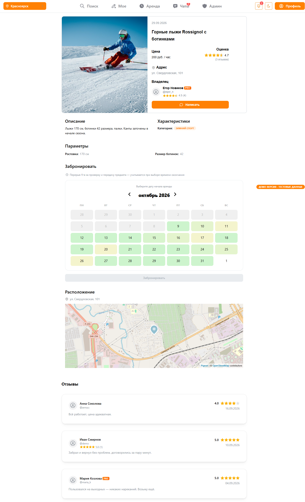
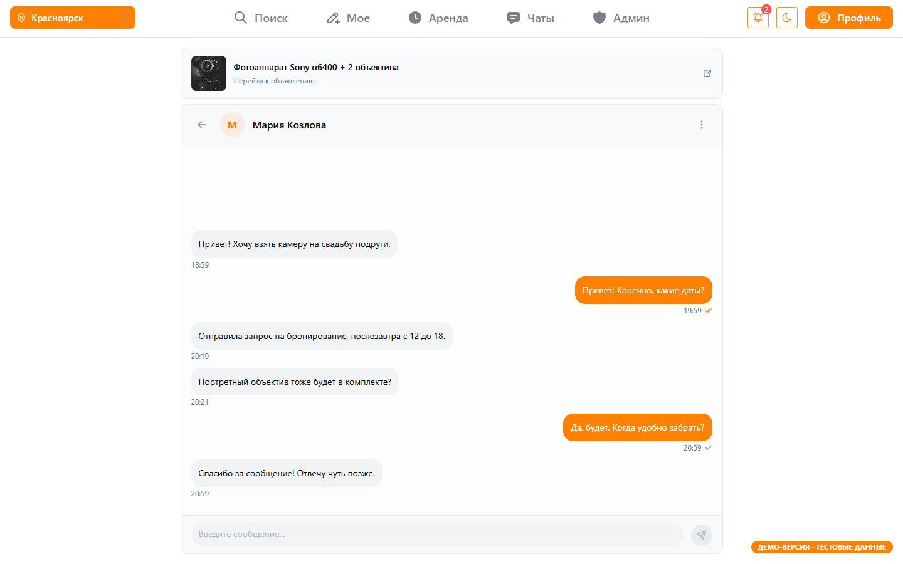
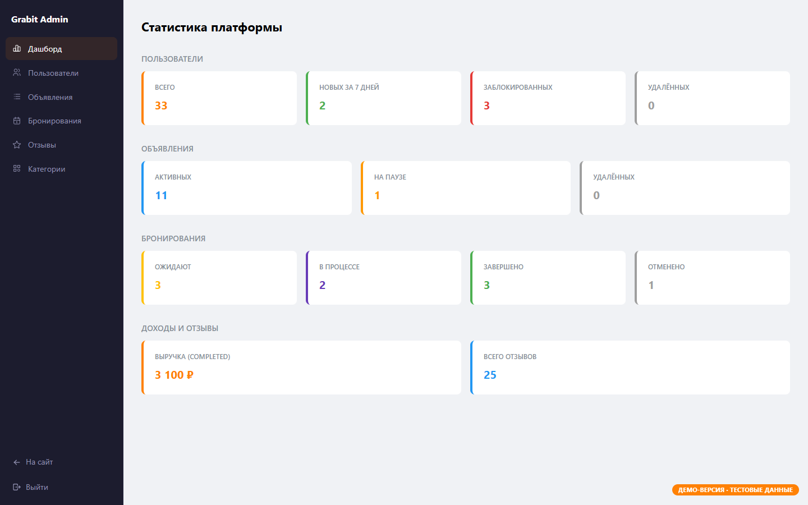

# GrabIt — фронтенд платформы аренды личных вещей

Веб-приложение, где люди сдают и берут в аренду вещи на несколько часов или дней: фотоаппарат на свадьбу, дрель на выходные, палатку в поход. Дипломный проект (защищён на «отлично»).

**Демо: [grabit-frontend-green.vercel.app](https://grabit-frontend-green.vercel.app/)** — работает без бэкенда, на тестовых данных. Войти можно одной кнопкой «Войти».

> Я делал клиентскую часть (этот репозиторий). Бэкенд на Go (микросервисы, Keycloak) писал напарник, в демо он заменён моками.



| Карточка и календарь занятости | Чат в реальном времени |
|---|---|
|  |  |
| **Админ-панель** | **Мобильная версия** |
|  |  |

## Что умеет

- **Поиск** по названию, категориям (дерево), цене, с сортировкой; список и **поиск на карте** в радиусе от выбранной точки
- **Карточка объявления**: галерея, характеристики, отзывы, карта, **календарь занятости** (тепловая карта по дням) и выбор свободных часов
- **Бронирование** с подтверждением владельцем: одобрить/отклонить, продление, отметка неявки, отзывы после завершения
- **Чат** между арендатором и владельцем в реальном времени: WebSocket, индикатор «печатает», редактирование и удаление сообщений, mute и блокировка
- **Создание объявления** пошаговым мастером: категория, детали, адрес на карте, фото с сортировкой перетаскиванием, расписание доступности
- **Профиль**, публичные профили с рейтингом владельца и арендатора, уведомления, премиум-подписка
- **Админ-панель**: статистика, пользователи, объявления, бронирования, отзывы, категории
- Светлая и тёмная тема, адаптив под мобильные, PWA

## Стек

| | |
|---|---|
| Основа | React 19, TypeScript, Vite |
| Роутинг | React Router v7 |
| Данные | TanStack Query, Axios |
| UI | Mantine (core, dates, form, notifications), Tabler Icons |
| Карты | pigeon-maps + OpenStreetMap, Nominatim для геокодинга |
| Drag & drop | dnd-kit |
| Реалтайм | нативный WebSocket |
| PWA | vite-plugin-pwa |
| Демо-режим | MSW (Mock Service Worker) |
| Качество кода | ESLint (с проверкой границ слоёв FSD), Prettier, Husky + lint-staged |

## Архитектура — Feature-Sliced Design

```
src/
├── app/        # инициализация: провайдеры, роутинг, демо-моки
├── pages/      # страницы — собирают виджеты и фичи
├── widgets/    # крупные блоки интерфейса: шапка, нижняя навигация, список чатов
├── features/   # пользовательские сценарии: поиск, создание и редактирование объявления, авторизация, админка
├── entities/   # бизнес-сущности: объявление, пользователь, отзыв, карта
└── shared/     # API-клиент, типы, конфиги, переиспользуемый UI
```

Слой может импортировать только слои ниже себя. Правило описано в ESLint (`eslint-plugin-boundaries`); несколько старых импортов его ещё нарушают — в процессе исправления.

## Интересные решения

- **Адаптеры API** (`shared/api/adapters.ts`): ответы бэкенда в snake_case приводятся к фронтовым моделям в одном месте. Если бэкенд меняет формат, правится один адаптер, а не компоненты.
- **Кэш и инвалидация**: после мутаций (бронирование, отзыв, пауза объявления) нужные запросы инвалидируются через `invalidateQueries`, и данные на всех экранах обновляются без ручной синхронизации состояния.
- **Глобальная обработка 401**: интерцептор Axios отправляет событие `auth:unauthorized`, `AuthProvider` сбрасывает пользователя и кэш. Защита от бесконечного цикла перезагрузок, если 401 пришёл при первой проверке сессии.
- **Загрузка видео по presigned URL**: файл уходит напрямую в объектное хранилище (MinIO), минуя бэкенд, и затем подтверждается отдельным запросом.
- **Демо-режим без бэкенда**: MSW перехватывает запросы на уровне Service Worker, поэтому код приложения не знает о моках. Работают все сценарии, включая WebSocket: собеседник в чате «печатает» и отвечает. В JS-бандл обычной сборки моки не попадают (динамический импорт под условием `import.meta.env.MODE`, которое Vite вычисляет при сборке).

## Запуск

```bash
npm install

npm run dev:demo     # демо на моках, бэкенд не нужен
npm run dev          # с настоящим API (VITE_API_URL в .env, см. .env.example)

npm run build:demo   # сборка демо (её деплоит Vercel)
npm run build        # продакшн-сборка
npm run lint
```

## Демо-режим подробнее

- Моки лежат в `src/app/mocks`: in-memory «база» (`db.ts`) и обработчики по доменам (`handlers/`). Данные живут до перезагрузки страницы.
- Вход через Keycloak заменён флагом в `localStorage`. Демо-пользователь заодно администратор, чтобы была видна админ-панель.
- Объявления генерируются вокруг выбранной на карте точки, поэтому поиск работает в любом городе.
- В демо-сборке PWA отключён: service worker на этом же адресе занят MSW.
